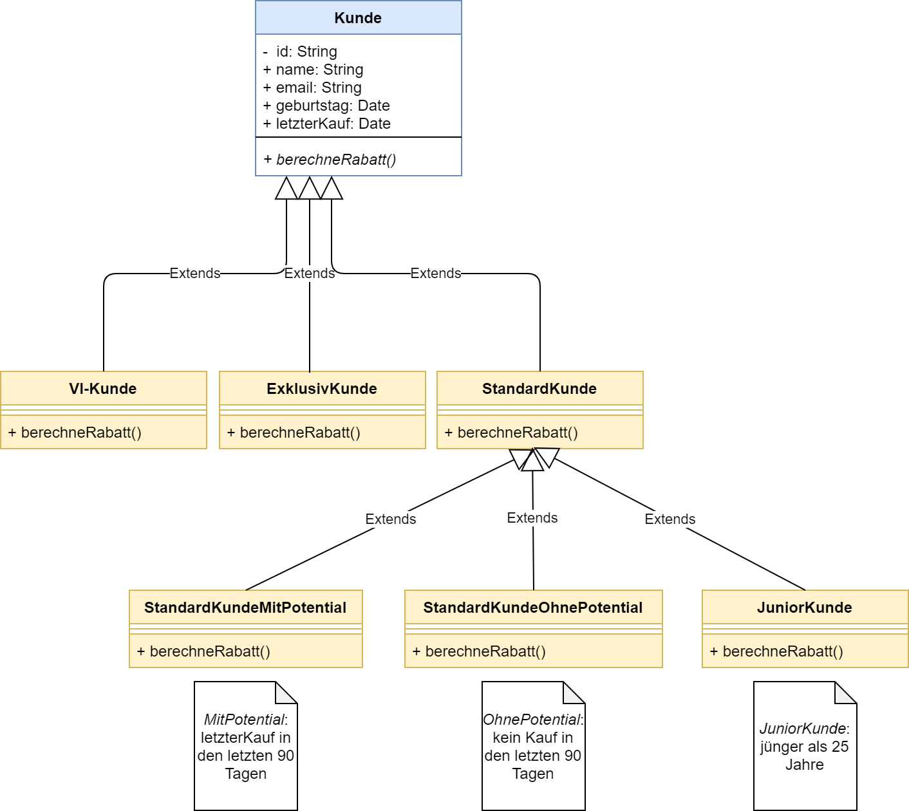

# Generate customer reports for sales optimization

    As a controller, I want to create reports about customers with all relevant data.

## Class Diagram

### Implementation Plan

1. Create classes and class dependencies as described in the diagram
   * All Kunden have IDs, names, email addresses, birthdate and lastPurchase
   * The following types of Kunden exists: `StandardKunde`, `ExklusivKunde`, `VIKunde`, `JuniorKunde`
   * There are two specializations of `StandardKunde`: `StandardKundeMitPotential` and `StandardKundeOhnePotential`
   * All Kunden implement a `berechneRabatt(int wert)` method, which calculates and returns the discount depending on the type of Kunde
   * The type of Kunde is determined by the last column of the CSV file: S,E,V

**This should be implemented in class `KundeImporter`**
2. Read `Kunden` from `new File("src/test/resources/kunden_reports.csv")`.

    * For each file: Split each line into a String array, use the correct separator string ","
    * For each line: Convert each line into an object of the correct type of Kunde, which already has a suitable constructor (id,name,email)

3. Add all Kunde objects to a new `List<Kunde>`

**This should be implemented in class `KundeReporting`**

4. Create a method which prints only Kunden of type parameter, `List<Kunde> filterKunden(List<Kunde> allKunden, String type)`
5. Create a method which sorts `List<Kunde>` for `name`
6. Create a method which sorts `List<Kunde>` for `lastPurchase`

**This should be implemented in class `KundeSales`**

7. Create a method `void sendNewsletter(List<Kunde> allKunden)` which sends a newsletter to `VI-Kunden` and `StandardKundenMitPotential`: **Hello NAME, you are invited to our new product demo.**