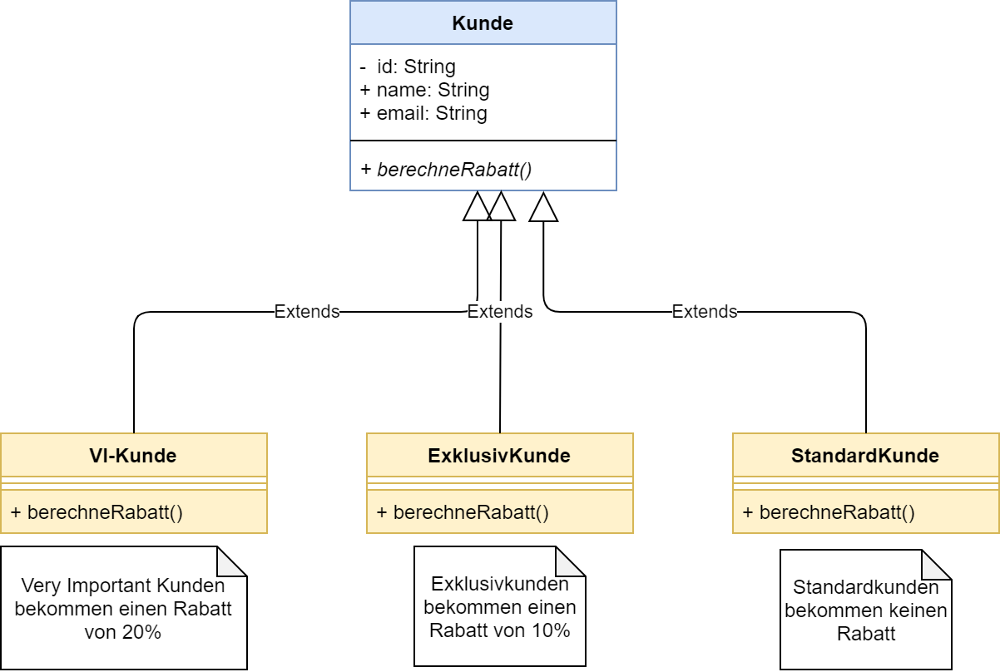

# Calculate discounts for all customers depending on their relevance

    As a customer, I want to see the discount I get on a new product.

## Class Diagram

### Implementation Plan

1. Create classes and class dependencies as described in the diagram
   * All Kunden have IDs, names and email addresses.
   * The following types of Kunden exists: `StandardKunde`, `ExklusivKunde`, `VIKunde`
   * All Kunden implement a `berechneRabatt(int wert)` method, which calculates and returns the discount depending on the type of Kunde
   * The type of Kunde is determined by the file the data is stored (standard/exklusiv/vi)

2. Read `StandardKunden` from `new File("src/test/resources/kunden_standard.csv")`.
3. Read `ExklusivKunden` from `new File("src/test/resources/kunden_exklusiv.csv")`.
4. Read `VIKunden` from `new File("src/test/resources/kunden_vi.csv")`.

    * For each file: Split each line into a String array, use the correct separator string ","
    * For each line: Convert each line into an object of the correct type of Kunde, which already has a suitable constructor (id,name,email)

5. Add all Kunde objects to a new `List<Kunde>`
6. For all Kunden, print the String: **"I am Kunde NAME with Id ID and a will pay only WERT-RABATT euros for the new product!"**
